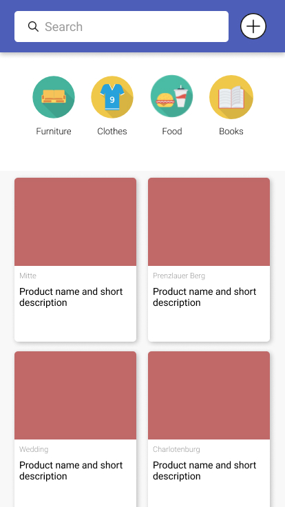
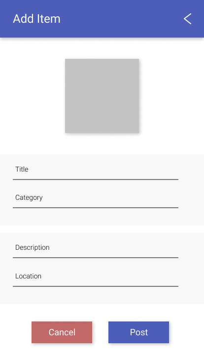
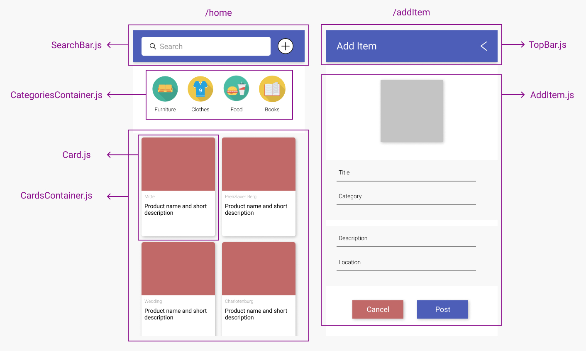

# Give Away

## Overview

Give Away is a basic React application intended for people to give away stuff they don't need.

## Details

- This project is just for me to practice React. I have no intention in publishing the app.
- The "users" I want to have are my collegues so I can get some feedback regarding what I could have done better.

## Wireframes

## New skills

(what did you research for this project?)

## Challenges + lessons learned

(What didn't go well? How would you advise future-you so it goes better next time?)

## Achievements

(What did you do this time that was an improvement on last time? Acknowledge your progress, you've earned it!)

